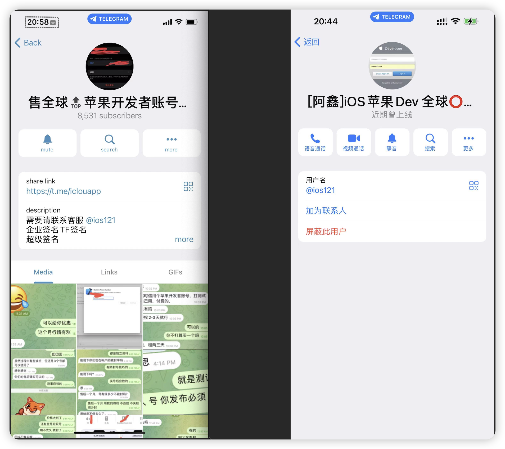

# Scam User On Telegram
## 建立此项目，目的很明确，是为了公开曝光Telegram上，以各种名义进行欺诈行为的用户，避免其他人再次受骗上当！


```
用户名：@ios121

对应名称：[阿鑫]iOS苹果Dev 全球⭕️出售（代续费注册）


对应频道链接：https://t.me/iclouapp

对应频道名称：售全球🔝苹果开发者账号（代注册续费）

频道里面有8K多的订阅人数，希望不要有更多的人受骗上当。
```




```
受骗过程：
一开始在Telegram上找到了他的频道，然后通过频道上的联系方式，跟这个人进行对话了，我这边打算找他处理苹果开发者账号-海外账号的续费问题，地区是巴基斯坦，因为我这边自己无法续费。后面了解到他说费用要1500，只能用U或者支付宝口令红包进行付款（聊到这里，我这边其实就感觉到不太对劲，这两种支付方式，只要给出去了。都是无法追回的）。

后面跟领导沟通之后，打算尝试一次合作，但是对他不信任的关系，就跟他说，先给一部分预付款，处理成功后再给尾款。但是他那边要求预付要1k，这费用真不低，还说这个账号续费问题，处理时间大概3天左右，因为公司项目比较急，就跟这个人合作了。转账后，交接了账号信息，也有看到他有绑定手机登录的痕迹。但是这个人后面的回复速度是越来越慢，基本都是一天回你几句话就不见人了。

拖了一个星期左右，账号续费无果，要求他退款后，发现他在频道里把我给踢出来了。第二天继续催退款，他还在装，说财务已经转出去了，当我截图频道被踢出，无法再加入的内容给他时，他立马就把我们的聊天记录清除掉，然后帮我拉黑。
```

